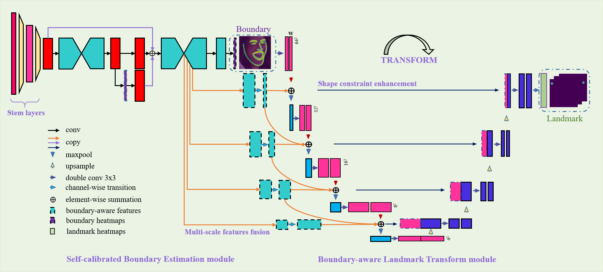
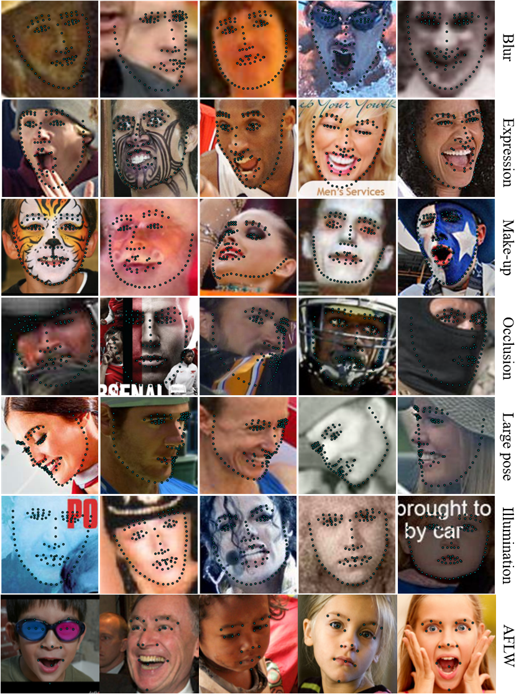

## Facial Landmark Detection
<div align=center>


</div>

## Introduction
This is the official code of .
<div align=center>



</div>
<!--## Performance
<div align=center>



</div>
-->

## Performance
### WFLW

| NME |  *test* | *pose* | *expression* | *illumination* | *makeup* | *occlution* | *blur* | 
|:--:|:--:|:--:|:--:|:--:|:--:|:--:|:--:|
|TAB | 3.94 | 6.70 | 4.11 | 3.84 | 3.85 | 4.56 | 4.45|

## Quick start
#### Environment
This code is developed using on Python 3.7 and PyTorch 1.0.0 on Ubuntu 16.04 with NVIDIA GPUs. Training and testing are 
performed using 1 NVIDIA P100 GPU with CUDA 9.0 and cuDNN 7.5. Other platforms or GPUs are not fully tested.

#### Install
1. Install PyTorch 1.0.0 following the [official instructions](https://pytorch.org/)
2. Install dependencies
````bash
pip install -r requirements.txt
````

#### Demo
1. Download pre-trained model from [BaiduYun(Acess Code:p1q9)](https://pan.baidu.com/s/1lwc7zTz8HTFM0mu0hCUM6w) to `pre-trained` directory.

```bash
python tools/demo.py --cfg experiments/wflw/face_alignment_wflw_tab.yaml --type video --best_model pre-trained/wflw_nme_0.0394_best_checkpoint_vgg_multi-scale_2x.pth
```


#### Data

1. You need to download the annotations files(supported by HRNet) which have been processed from [OneDrive](https://1drv.ms/u/s!AiWjZ1LamlxzdmYbSkHpPYhI8Ms), [Cloudstor](https://cloudstor.aarnet.edu.au/plus/s/m9lHU2aJId8Sh8l), and [BaiduYun(Acess Code:ypxg)](https://pan.baidu.com/s/1Yg1IEp3l2IpGPolpUsWdfg).

Your `data` directory should look like this:

````
TAB
-- experiments
-- images
-- lib
-- tools
-- data
   |-- wflw
   |   |-- face_landmarks_wflw_test.csv
   |   |-- face_landmarks_wflw_test_blur.csv
   |   |-- face_landmarks_wflw_test_expression.csv
   |   |-- face_landmarks_wflw_test_illumination.csv
   |   |-- face_landmarks_wflw_test_largepose.csv
   |   |-- face_landmarks_wflw_test_makeup.csv
   |   |-- face_landmarks_wflw_test_occlusion.csv
   |   |-- face_landmarks_wflw_train.csv
   |-- aflw
   |   |-- face_landmarks_aflw_test.csv
   |   |-- face_landmarks_aflw_test_frontal.csv
   |   |-- face_landmarks_aflw_train.csv
   |   |-- images
   |-- cofw
   |   |-- COFW_test_color.mat
   |   |-- COFW_train_color.mat  
   |-- wflw
   |   |-- face_landmarks_wflw_test.csv
   |   |-- face_landmarks_wflw_test_blur.csv
   |   |-- face_landmarks_wflw_test_expression.csv
   |   |-- face_landmarks_wflw_test_illumination.csv
   |   |-- face_landmarks_wflw_test_largepose.csv
   |   |-- face_landmarks_wflw_test_makeup.csv
   |   |-- face_landmarks_wflw_test_occlusion.csv
   |   |-- face_landmarks_wflw_train.csv
   |   |-- images
   |-- cofw68
   |   |-- points
   |   |-- COFW_test_color.mat
   |   |-- cofw68_test_bboxes.mat
   |-- 3d_data
   |   |-- AFLW200
   |   |-- 300W_LP
   |   |-- aflw2000_3D_anno_vd.json
   |   |-- 300wLP_anno_tr.json
````

#### Train the SCBE module
Please specify the configuration file in `experiments` (learning rate should be adjusted when the number of GPUs is changed).
````bash
python tools/train_scbe.py --cfg experiments/wflw/face_alignment_wflw_tab.yaml
````

#### Train the whole model
Please specify the configuration file in `experiments` (learning rate should be adjusted when the number of GPUs is changed).
````bash
python tools/train_tab.py --cfg experiments/wflw/face_alignment_wflw_tab.yaml
````

#### Test the model
Please specify the configuration file in `experiments` (learning rate should be adjusted when the number of GPUs is changed).
````bash
python tools/test.py --cfg experiments/wflw/face_alignment_wflw_tab.yaml --best_model pre-trained/wflw_nme_0.0394_best_checkpoint_vgg_multi-scale_2x.pth
````

## Citation

## Aknowlegement
Thanks for [HRNet's](https://github.com/HRNet) open source project.